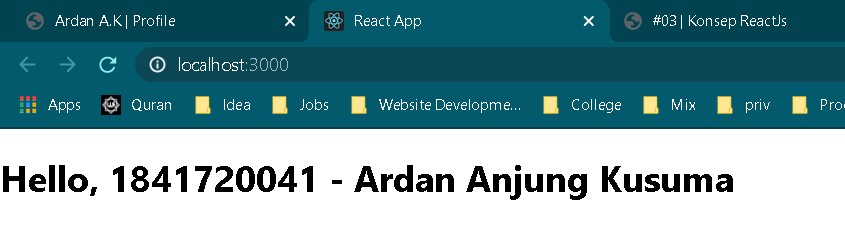
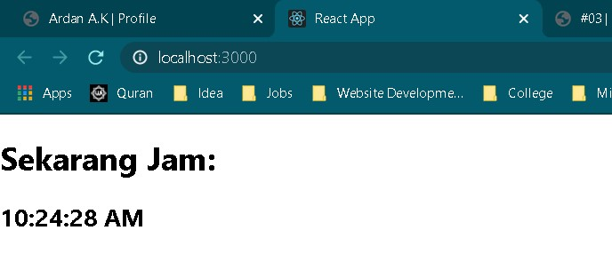
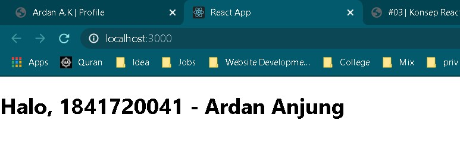
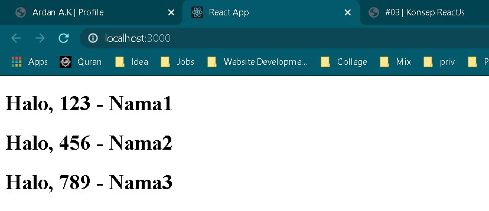
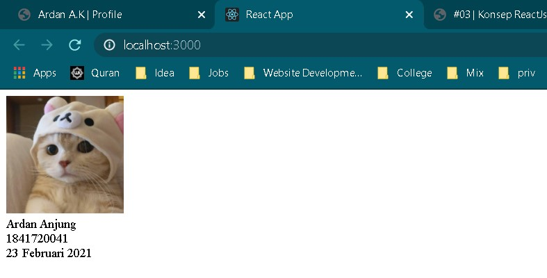
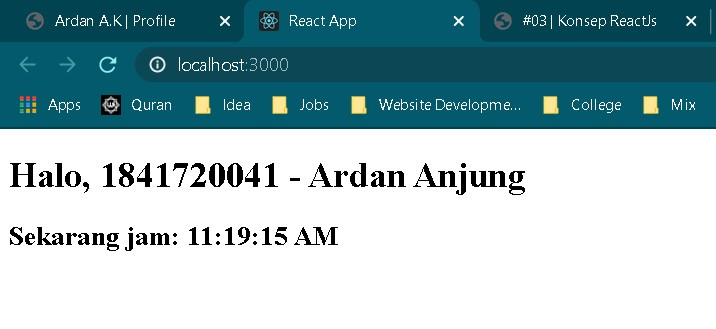

# 03 - Konsep ReactJS

## Tujuan Pembelajaran

1. Mahasiswa paham dengan konsep dan komponen dalam reactJS

## Hasil Praktikum

1. Praktikum 1

   

2. Praktikum 2

   

3. Praktikum 2

   

4. Praktikum 2

   

5. Praktikum 2

   

6. Praktikum 2

   
