# 04 - Konsep ReactJS Bagian 2

## Tujuan Pembelajaran

1. Mahasiswa paham dengan konsep dan komponen dalam reactJS

## Hasil Praktikum

1. Praktikum 1 - Cara 1

   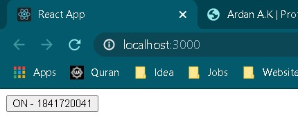

   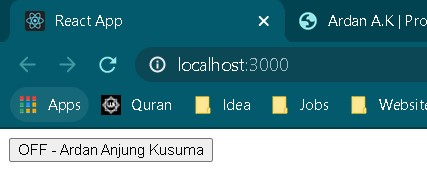

2. Praktikum 1 - Cara 2

   

   

3. Praktikum 1 - Cara 3

   

   

4. Praktikum 2

   - isLoggedIn = true

   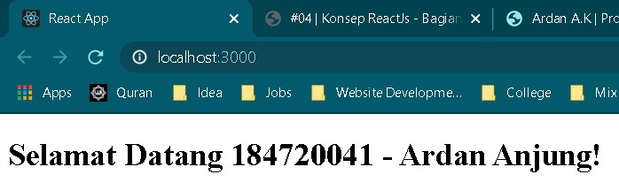

   - isLoggedIn = false

   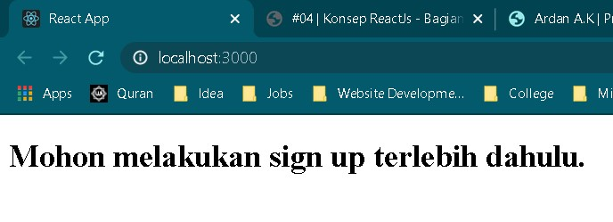

5. Praktikum 3

   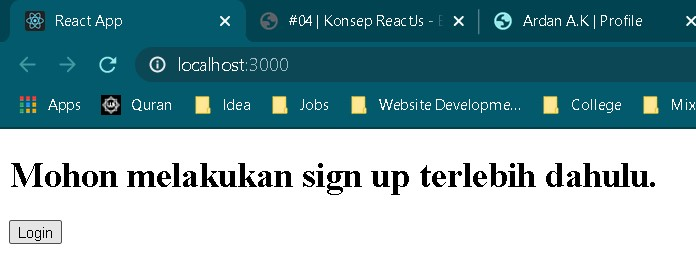

   

6. Praktikum 4

   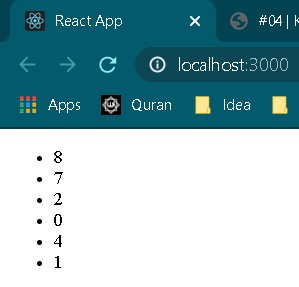

7. Praktikum 5

   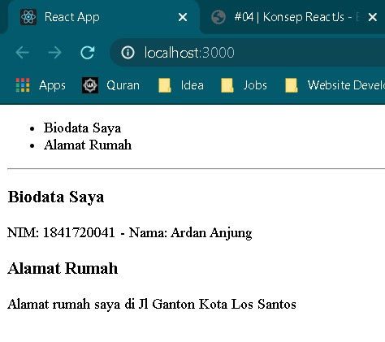

8. Praktikum 6 - Input Text

   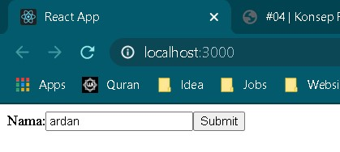

   - After Submit

   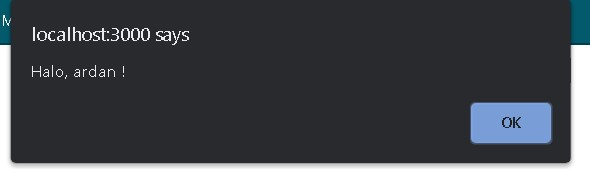

9. Praktikum 6 - Text Area

   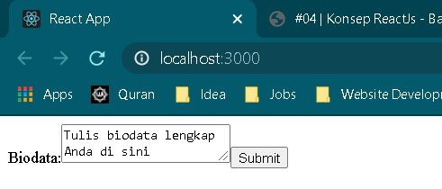

   - Input Data

   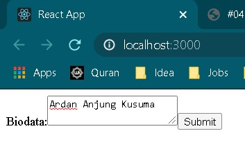

   - After Submit

   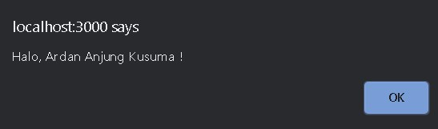

10. Praktikum 6 - Select

    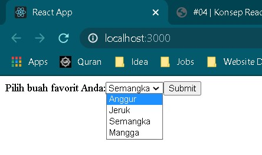

    - Input Data

    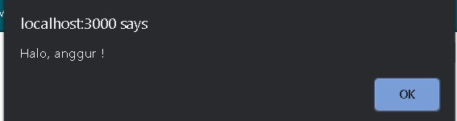

11. Praktikum 6 - Multiple Select

    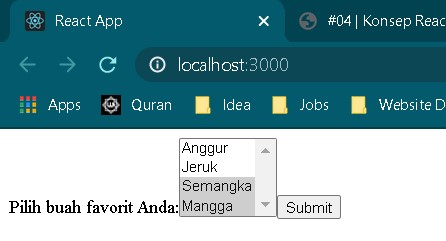

    - Choosing Data

    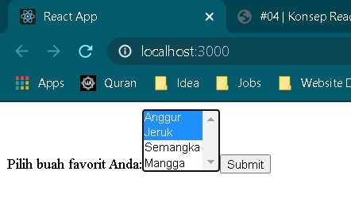

    - After Submit

    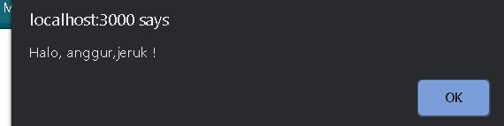
