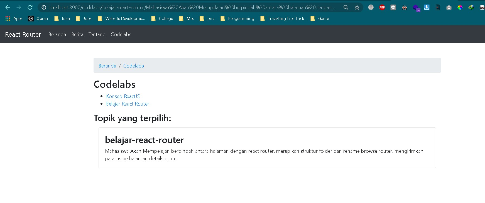

# 05 - API Router ReactJS

## Tujuan Pembelajaran

1. Mahasiswa paham dengan cara instalasi reactrouter
2. Mahasiswa dapat mengetahui konsep reactrouter

## Hasil Praktikum

1. Praktikum 1
   

   

2. Praktikum 2

   

   

   

3. Praktikum 3

   

   

   

4. Tugas

   

   

   

   

   
