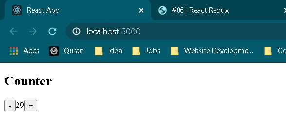

# 06 - Redux

## Tujuan Pembelajaran

1. Mahasiswa dapat memahami konsep state management dalam redux
2. Mahasiswa dapat menerapkan redux dalam reactapp

## Hasil Praktikum

1. Praktikum

   

## Jawaban Tugas

1. Fungsinya untuk memanggil dan mengirimkan ke store dan mentrigger agar state berubah sesuai dengan yang diclick

2. Jawaban

   a. Action = merupakan objek JavaScript ("{ }") yang memberitahu reducer untuk memodifikasi data. Syaratnya, action harus memiliki properti type berupa String.

   b. Reducers = sebuah fungsi yang memiliki kembalian data (return some data).

   c. Action Creators = fungsi yang mengembalikan suatu tindakan atau aksi.

   d. Middleware = Suatu point yang menjadi titik tengah saat mengirim aksi dan saat meraih reducers.

   e. Pure Function = Sebuah function yang jika diberi argumen yang sama maka akan menghasilkan output yang sama

   f. Immutability = Suatu objek yang tidak bisa dimodifikasi kembali setelah dibuat

   Refrensi :

   - https://redux.js.org/tutorials/fundamentals/part-2-concepts-data-flow

   - https://medium.com/skyshidigital/dasar-membuat-perubahan-state-aplikasi-redux-5bd607a5d831

3. `export default connect(mapStateToProps)(Counter);` berfungsi untuk menghubungkan react component (counter) ke Redux Store

4. [Link Project](https://github.com/mnindrazaka/react-redux-firebase-todoapp/blob/master/src/containers/TodoPage/index.js)

   Code

   a. `onSubmit = () => { this.props.dispatch(sendTodo(this.state.text)) this.setState({text: ''}) }`

   b. `deleteTodo = (id) => { this.props.dispatch(deleteTodo(id)) }`

   Penjelasan

   a. Saat terdapat sebuah aksi submit maka dia akan menjalankan dan mengirimkan sebuah todo berbentuk teks.

   b. Saat terdapat sebuah aksi deleteTodo dan terdapat parameter sebuah id maka akan menjalankan dan mengirimkan suatu fungsi deleteTodo dengan parameter id.
