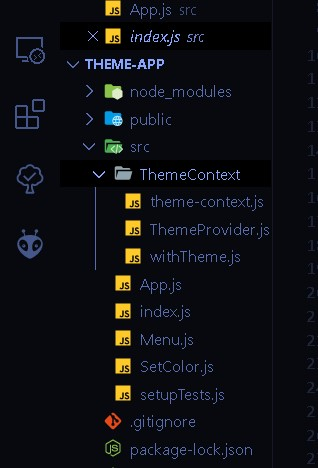
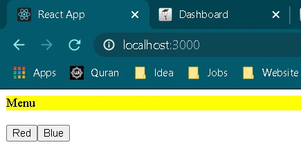
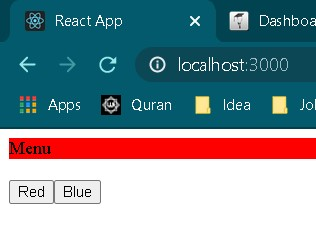
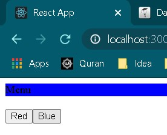

# 07 - CONTEXT HOC

## Tujuan Pembelajaran

1. Mahasiswa dapat memahami konsep Context dan manfaatnya
2. Mahasiswa dapat menerapkan konsep HOC di ReactJS

## Hasil Praktikum

1. Struktur Folder

2. Output

Warna default yaitu yellow

Jika diklik red maka akan berganti warna merah

Jika diklik blue maka akan berganti warna biru

