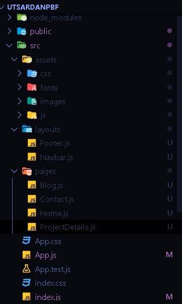
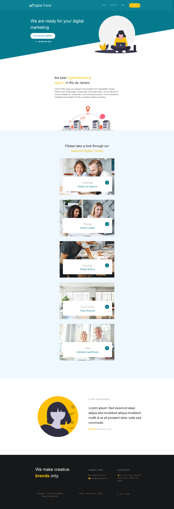
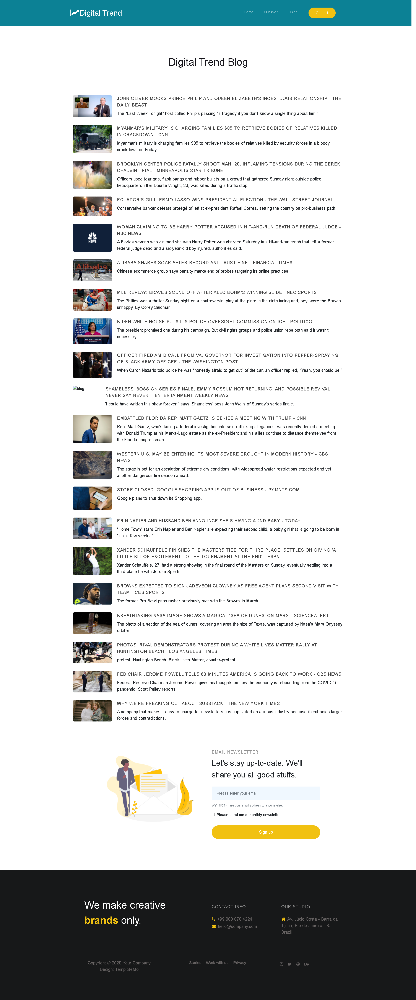
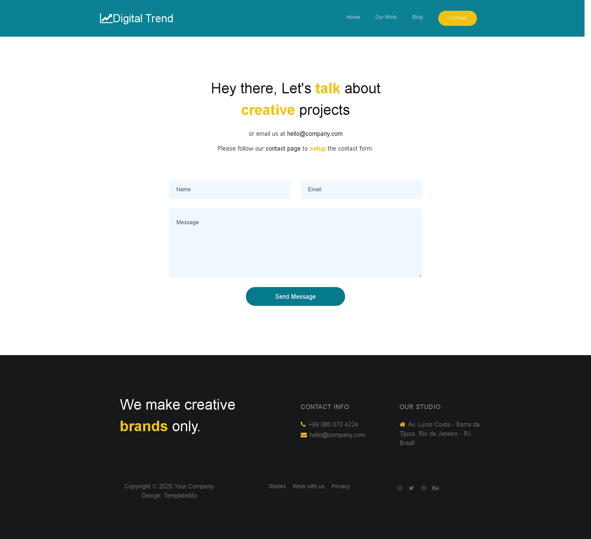
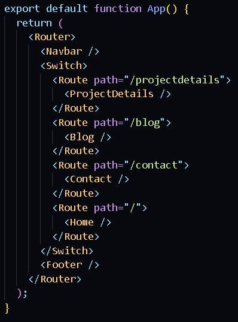
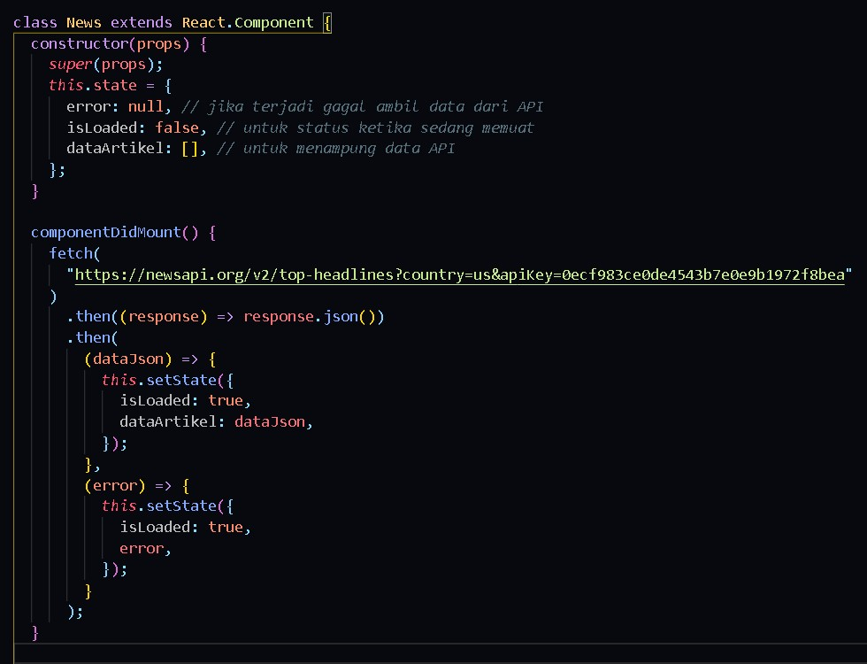
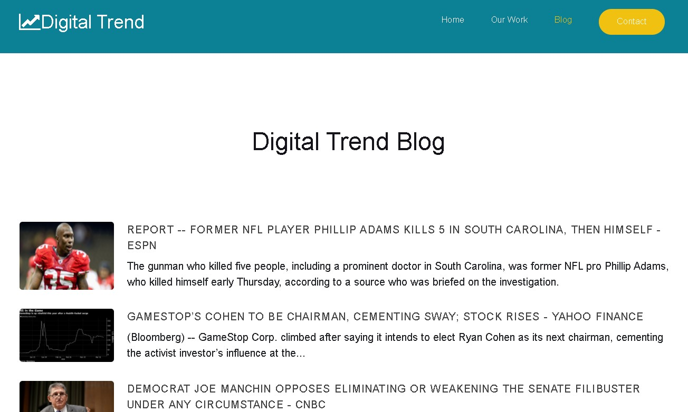
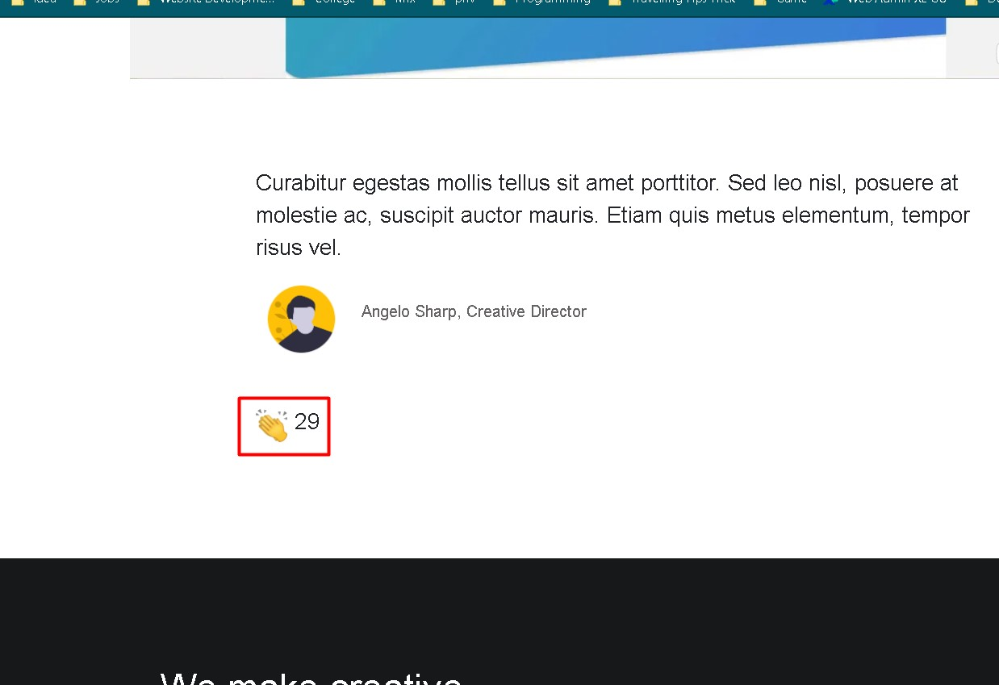

# 08 - Laporan UTS

## Soal

Anda diminta oleh sebuah perusahaan untuk mengonversi templat web pada tautan ini https://s.id/templat-web (sesuai pembagian presensi dari dosen) menjadi sebuah aplikasi React. Artinya, Anda harus mengubah HTML statis tersebut menjadi komponen-komponen React menjadi
sebuah Single-Page Application (SPA). Selain itu, ada permintaan spesifikasi lain, yaitu:

    a. Anda diminta untuk menggunakan React Router pada setiap menu di web tersebut.
    b. Anda diminta untuk meletakkan semua konten (seperti artikel, link gambar, komentar, dsb) web di file JSON kemudian dipanggil dengan API (GET).
    c. Anda diminta untuk menggunakan Redux agar konten web tersimpan di store, sehingga proses GET API tidak membutuhkan waktu lebih lama (low latency)

## Jawaban

1. Struktur Files Sesuai Best Practice

Terdapat beberapa folder contohnya assets, layouts, pages yang berguna untuk mengelompokkan file JS sesuai dengan fungsinya

2. Gambar Halaman per Halaman

Home

Blog

Contact

3. Struktur Utama App.js dan Implementasi React Router

Terdapat beberapa route yang nantinya menerima dan mengarahkan sesuai dengan permintaan user

4. Penggunaan News API Gratis Dari newsapi.org

Nantinya datanya akan dikeluarkan dalam bentuk blog dan jika diklik akan redirect ke postingan utama.

Output

5. Redux Fitur Claps Example Detail Project

Saat diklik claps maka akan increment satu claps angka

