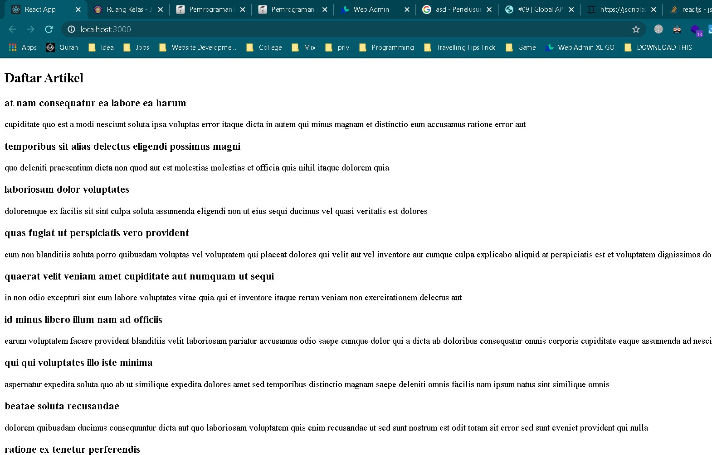
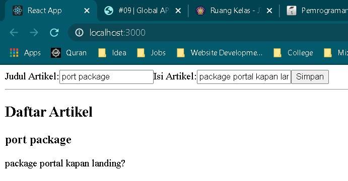
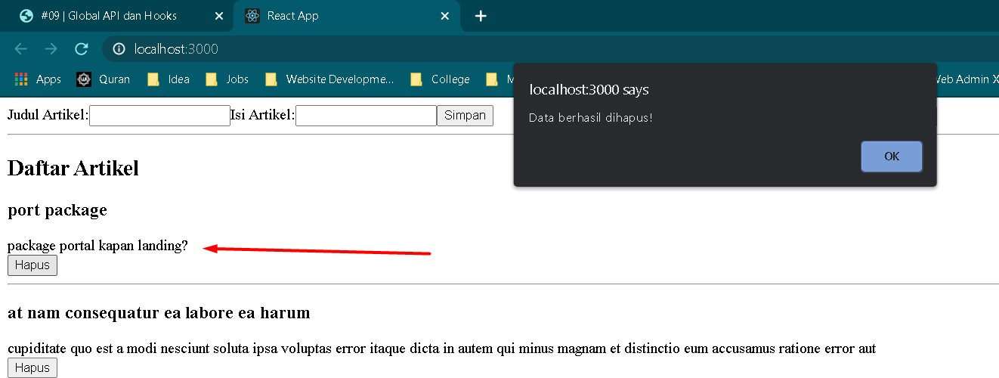
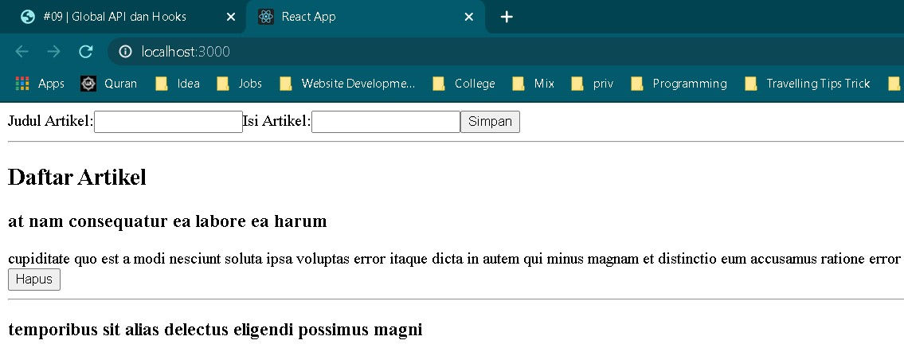
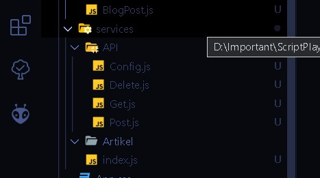
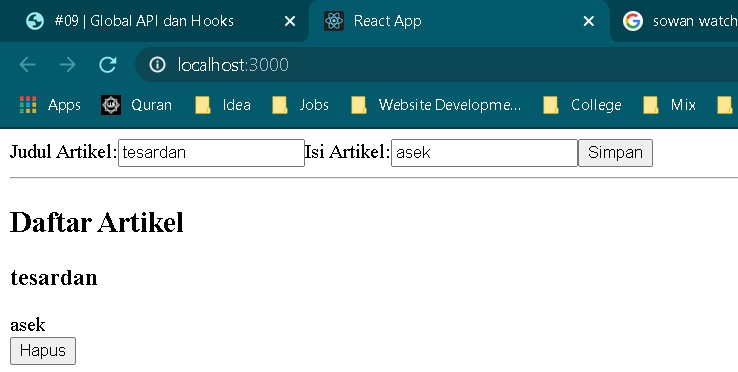
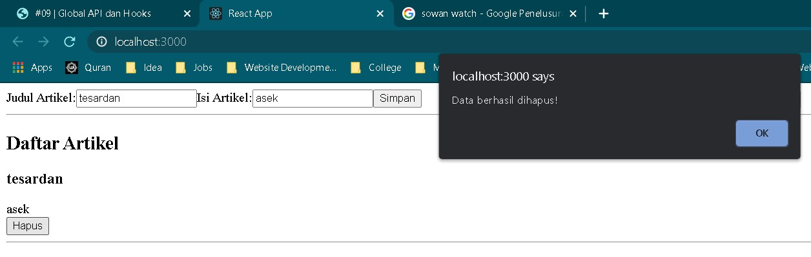

# 09 - Global API dan Hooks

## Tujuan Pembelajaran

1. Mahasiswa dapat memahami konsep dan implementasi Global API
2. Mahasiswa dapat memahami konsep dan implementasi Hooks

## Hasil Praktikum

1. Hasil dari GET data artikel sudah tampil sesuai isi dari listArtikel.json

2. Hasil dari POST data artikel ke listArtikel.json

3. Hasil dari DELETE data dari artikel

Sesudah didelete postingan hilang

4. Hasil dari Pengelolaan Global API

Untuk hasilnya sama saja berhasil

