# 10 - Firebase di ReactJS

## Tujuan Pembelajaran

1. Mahasiswa dapat memahami Konsep dan implementasi Firebase di ReactJS

## Hasil Praktikum

1. Hasil Tampilan Registrasi

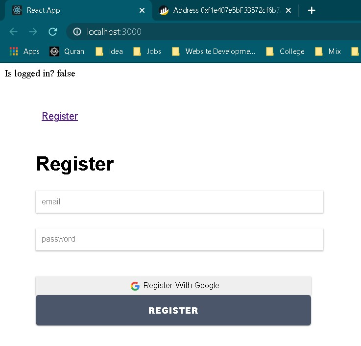

2. Hasil Tampilan Login

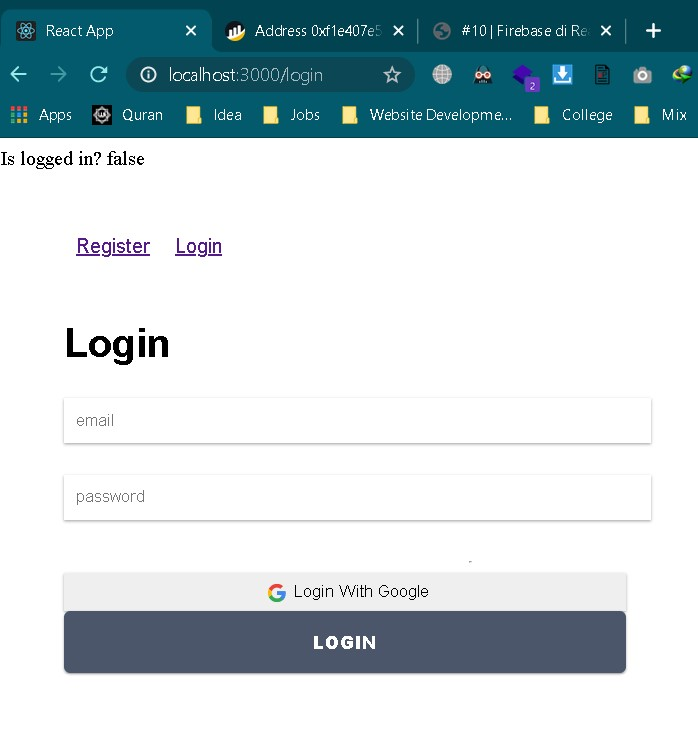

3. Hasil Registrasi Dengan Firebase

Hasil email dan password

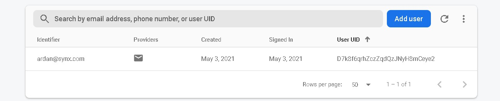

4. Hasil Login dengan Firebase dengan user yang terdaftar

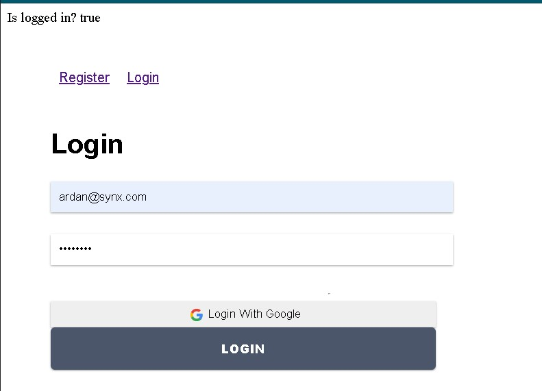

## Hasil Tugas

1. Register With Google Account

Loggin in == true after regist

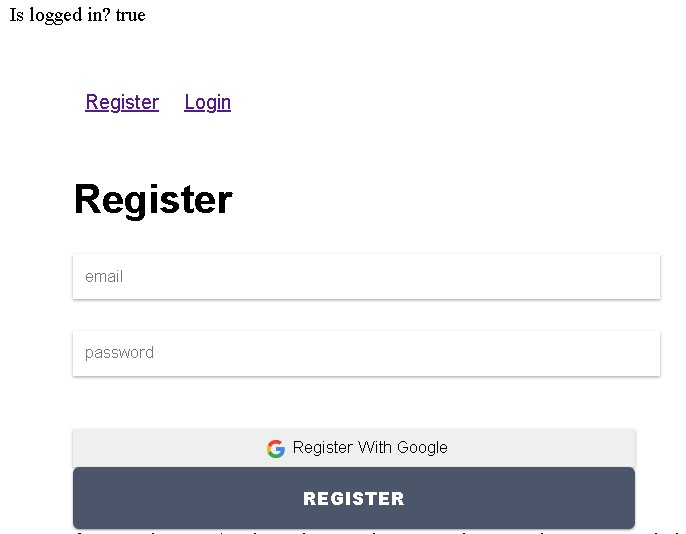

Tercatat di firebase

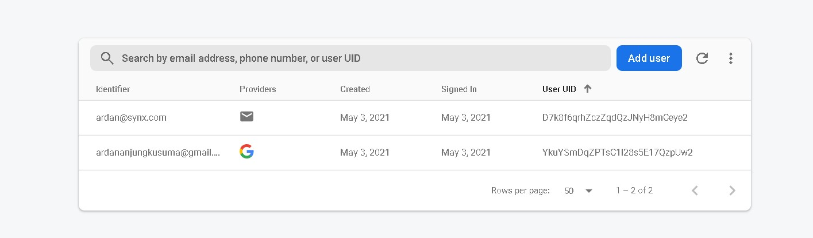

2. Login with Google Account

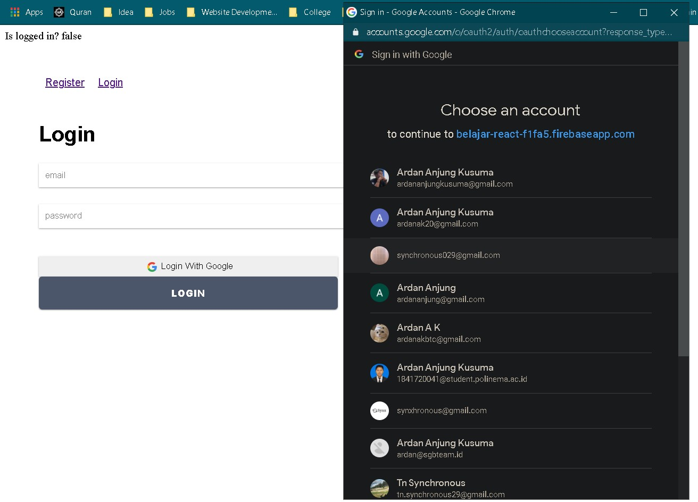

is logged in == true after login

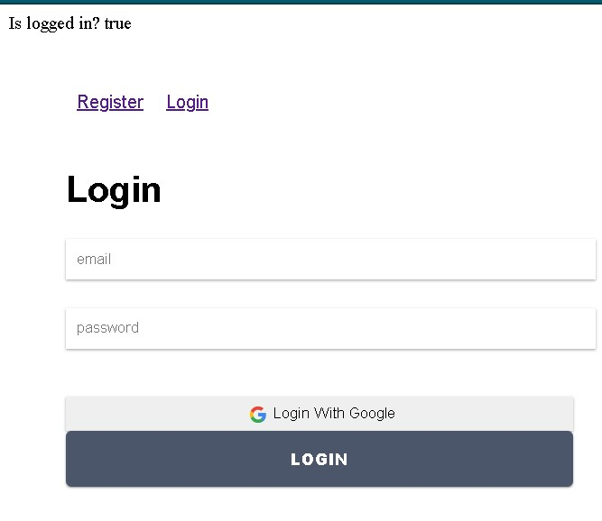

3. Register lalu logout

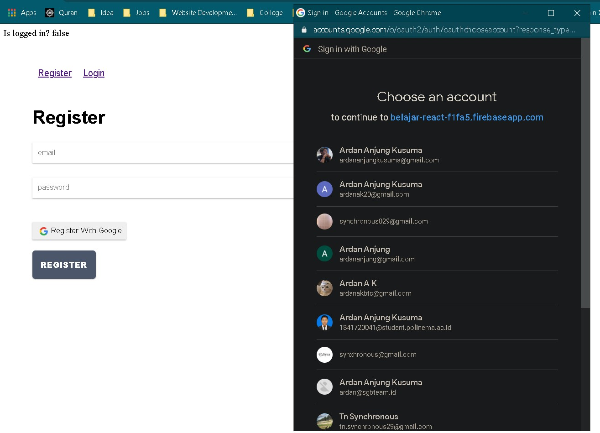

Jika sukses regis button akan ganti logout

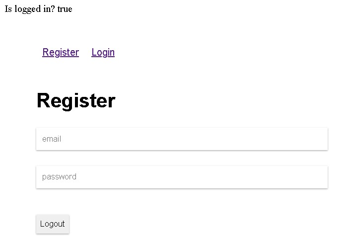

4. Login sukses lalu logout

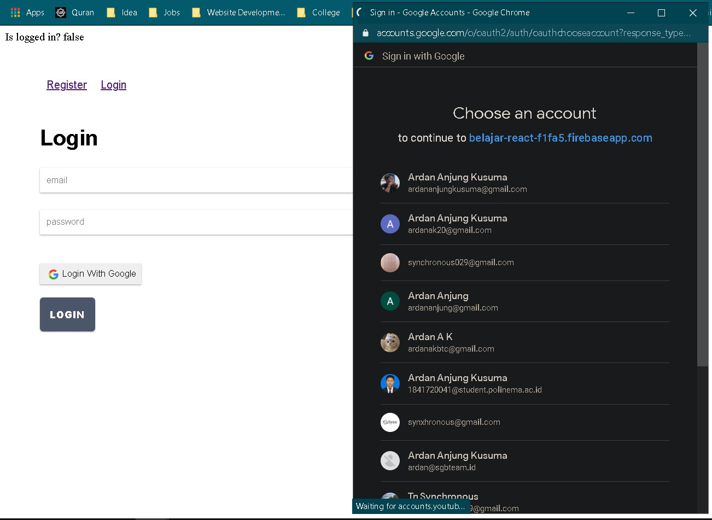

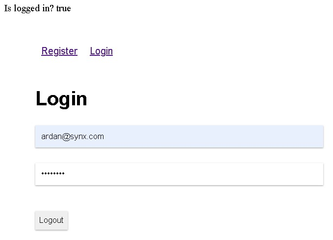
