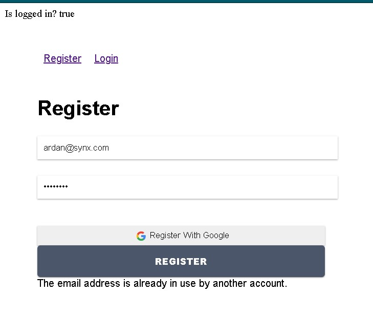
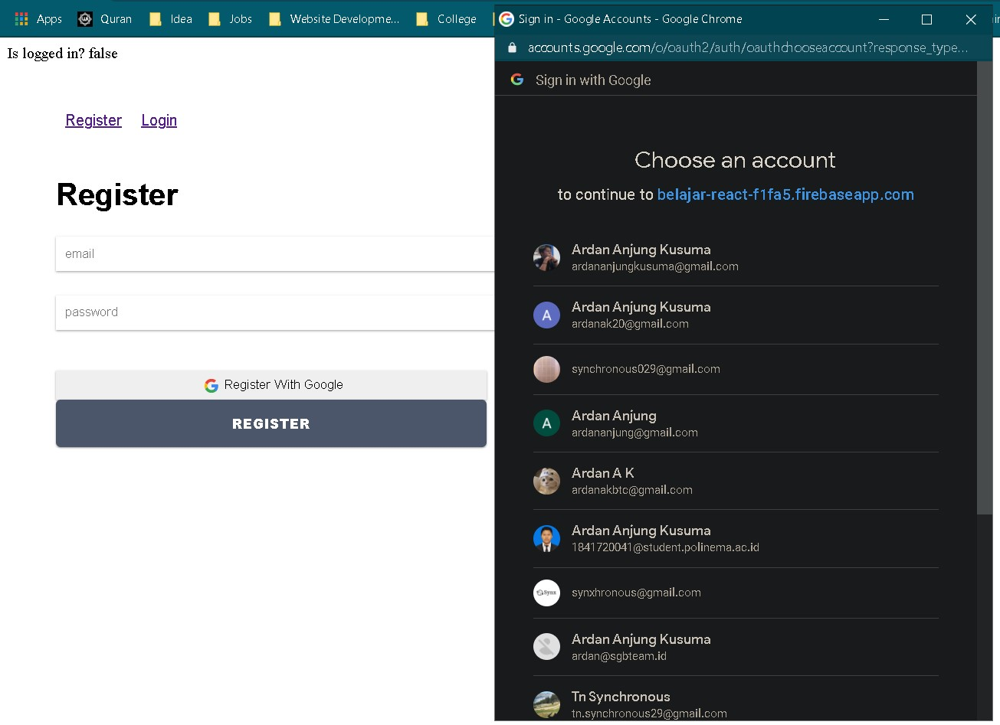

# 10 - Firebase di ReactJS

## Tujuan Pembelajaran

1. Mahasiswa dapat memahami Konsep dan implementasi Firebase di ReactJS

## Hasil Praktikum

1. Hasil Tampilan Registrasi

2. Hasil Tampilan Login

3. Hasil Registrasi Dengan Firebase

Hasil email dan password

4. Hasil Login dengan Firebase dengan user yang terdaftar

## Hasil Tugas

1. Register With Google Account

Loggin in == true after regist

Tercatat di firebase

2. Login with Google Account

is logged in == true after login

3. Register lalu logout

Jika sukses regis button akan ganti logout

4. Login sukses lalu logout

