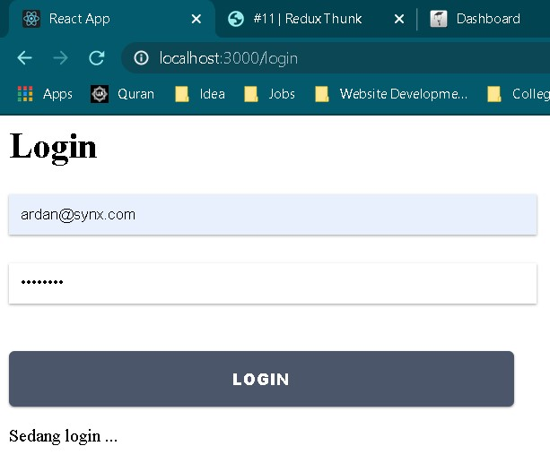
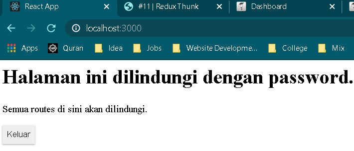
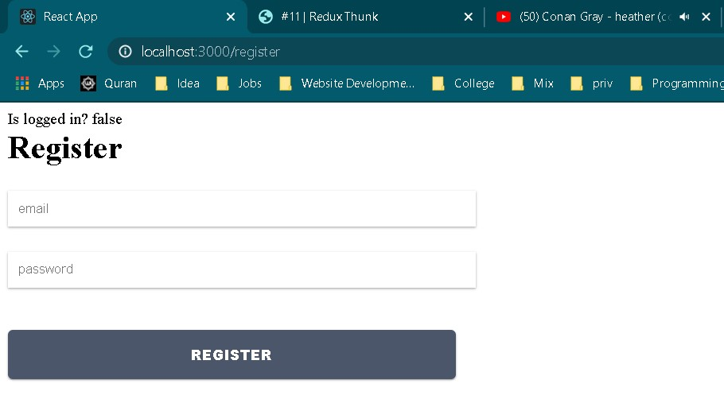
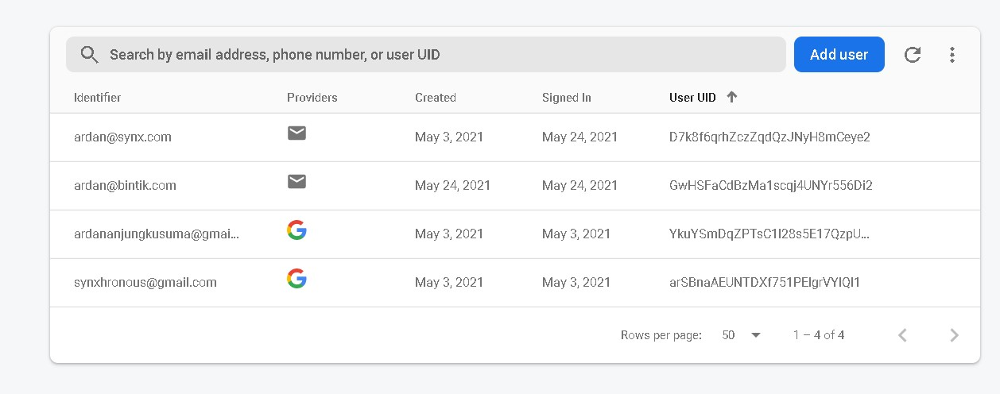
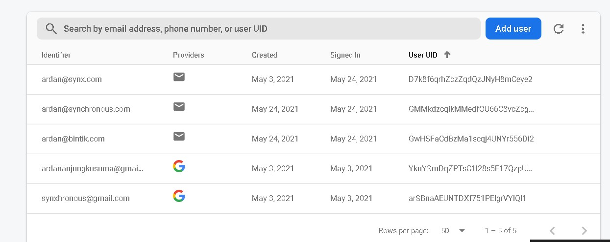
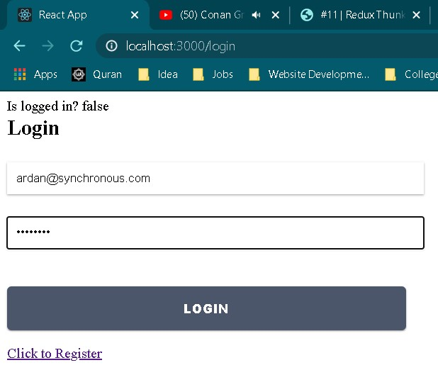
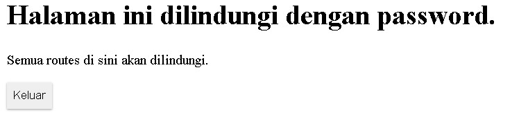

# 11 - Redux Thunk

## Tujuan Pembelajaran

1. Mahasiswa dapat memahami Konsep dan implementasi Redux-Thunk di ReactJS
2. Mahasiswa dapat memahami Konsep dan implementasi Firebase Login dengan Redux-Thunk di ReactJS

## Hasil Praktikum

1. Hasil Tampilan Login

   

2. Hasil Tampilan Sesudah Login

   

## Jawaban Praktikum

1. Karena pada login membutuhkan parameter props dan di home tidak membutuhkan suatu parameter

2. Untuk mengatur routing jika sedang verifying akan muncul sedang login, jika tidak isAuth maka akan redirect ke login.

3. Akan mengeluarkan pesan error email dan password salah karena isAuthenticated bernilai false alias gagal login.

4. Tidak bisa karena status isAuth masih true jadi route nya redirect ke home secara terus menerus

5. Jawaban

a. Screenshot Halaman Register

b. Screenshot Data User Firebase sebelum Register

c. Register User (ardan@synchronous.com)

d. Hasil Data Firebase Sesudah Register terdapat user baru

e. Mencoba login dengan user baru

f. Sukses login user baru

