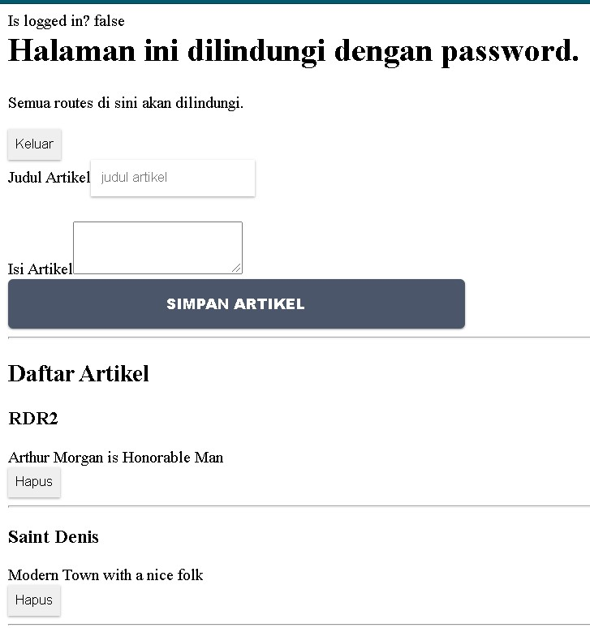
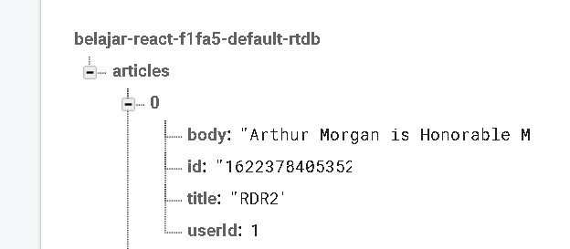
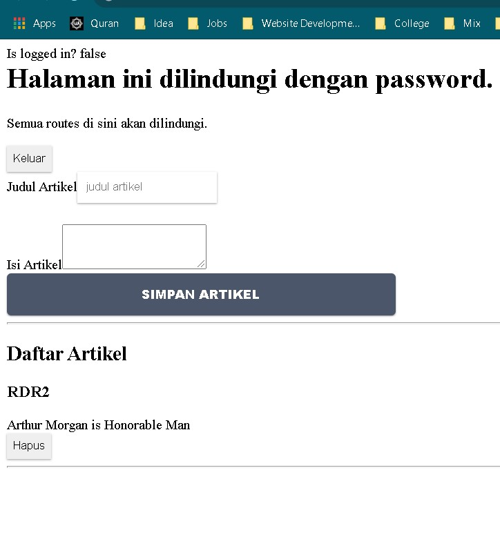
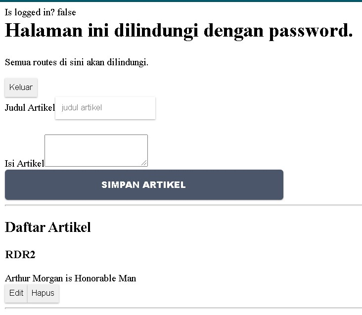
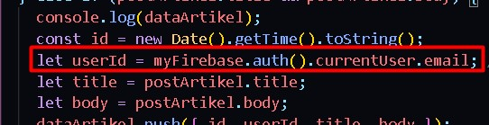
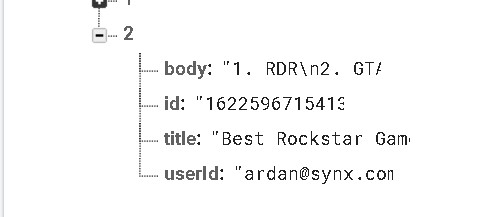
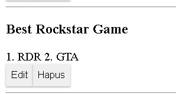
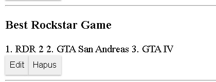

# 12 - CRUD Firebase

## Tujuan Pembelajaran

1. Mahasiswa dapat memahami Konsep dan implementasi CRUD dengan Firebase di ReactJS

## Hasil Praktikum

1. Tambah Artikel

   

   Penambahan data pada database

   

2. Hapus Artikel

   

3. Edit Artikel

   

## Jawaban Tugas Praktikum

1. Database secara default akan terbuka (bebas melakukan view, edit and delete all data) pada 30 hari kedepan, tapi anda harus memperbarui aturan keamanan Anda dalam waktu 30 hari untuk mengaktifkan akses baca / tulis klien jangka panjang.

2. Kode yang ditambahkan

   

   Hasilnya dapat merekam email

   

3. Kodingan tersebut berfungsi untuk melakukan pengecekan jika dataArtikel atau array nantinya akan menampilkan map data yang ada pada database di firebase.

4. Sebelum diedit

   

   Sesudah Diedit

   

5.
