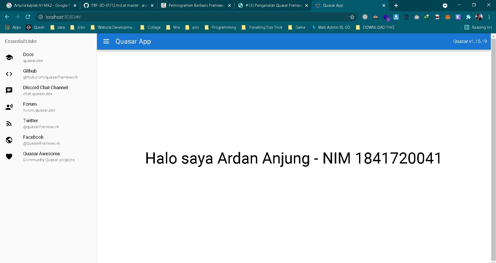

# 13 - Quasar

## Tujuan Pembelajaran

1. Mahasiswa dapat memahami Pengenalan dan instalasi Quasar Framework
2. Mahasiswa dapat memahami Sekilas tentang Vue.js

## Hasil Praktikum

1. Hello world quasar

   
