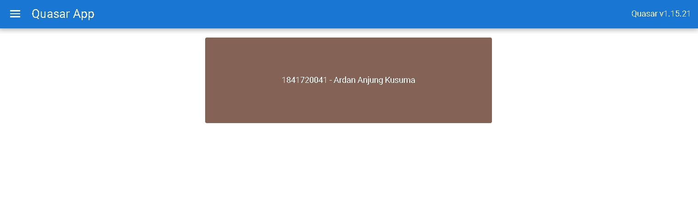
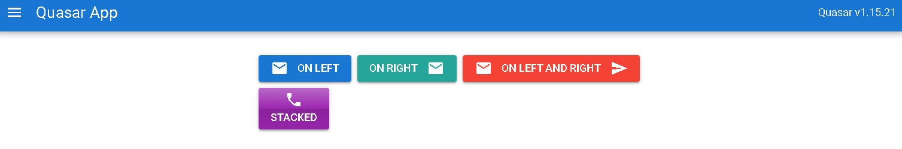

# 14 - Quasar Directives Component

## Tujuan Pembelajaran

1. Mahasiswa dapat memahami Pengenalan Quasar Directives
2. Mahasiswa dapat memahami Pengenalan Quasar Components

## Hasil Praktikum

1. Hasil Praktikum 1

   

2. Hasil Praktikum 2

   

## Jawaban Tugas Praktikum

1. Fungsi dari `class="q-pa-md row justify-center"` adalah menentukan padding all medium dan meletakannya ditengah.

2. Kegunaan dari script dibawah

   - colors = Menstore array warna.

   - data() = Mereturn color default yang digunakan yaitu primary (biru muda).

   - computed = Mereturn value color atau warna yang terpilih indexnya saat itu.

   - mounted = Menset time interval untuk perubahan warna yaitu selama 3000 milisecond atau 3 detik.

   - beforeDestroy() = Fungsi untuk menghapus interval berdasarkan parameter timer yang telah kita set sebelumnya.

3. Penjelasan kode HTML :

   - `<q-btn color="primary" icon="mail" label="On Left" />` = Button color berwarna primary atau biru dan button posisi secara default pada kiri dengan icon mail.

   - `<q-btn color="secondary" icon-right="mail" label="On Right" />` = Button color berwarna secondary atau biru muda dan posisi diset icon right alias posisi iconnya berada pada kanan dengan icon mail.

   - `<q-btn color="red" icon="mail" icon-right="send" label="On Left and Right" />` = Button color berwarna merah dengan icon dikiri yaitu mail dan icon dikanan berupa send atau pesawat kertas.

   - `<q-btn icon="phone" label="Stacked" stack glossy color="purple"/>` = Button dengan warna purple dan style nya yang glossy lalu untuk icon phone dengan style stacked atau bertumpuk, jadi icon dulu lalu teks.

4. Dalam template komponen pada vue kita membutuhkan paling tidak 1 root element dimana pada kodingan sebelumnya root element kita adalah `
` yang membungkus semua kode pada template.
